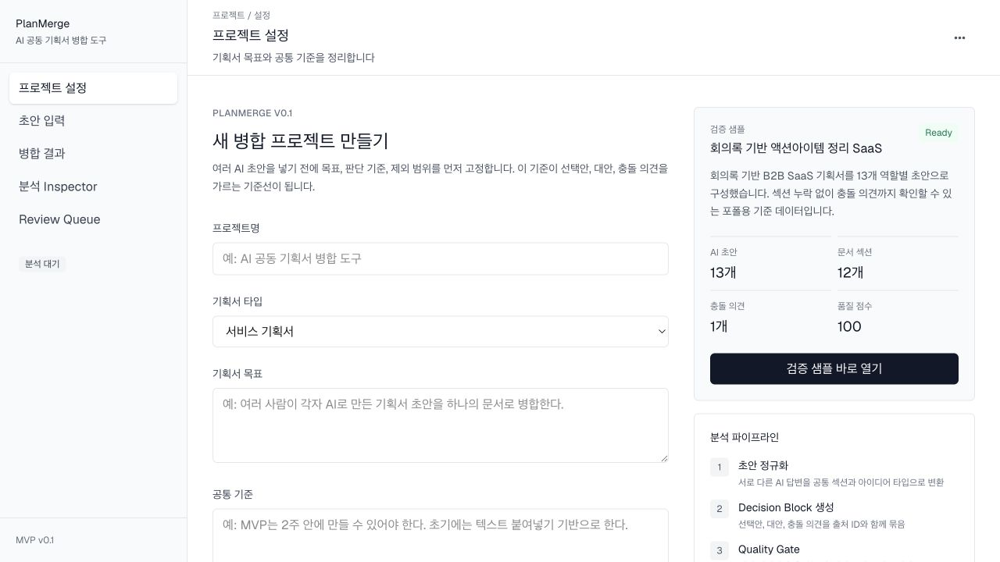
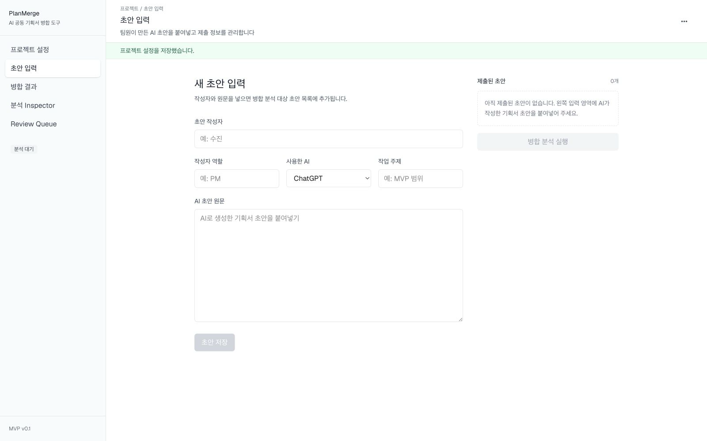
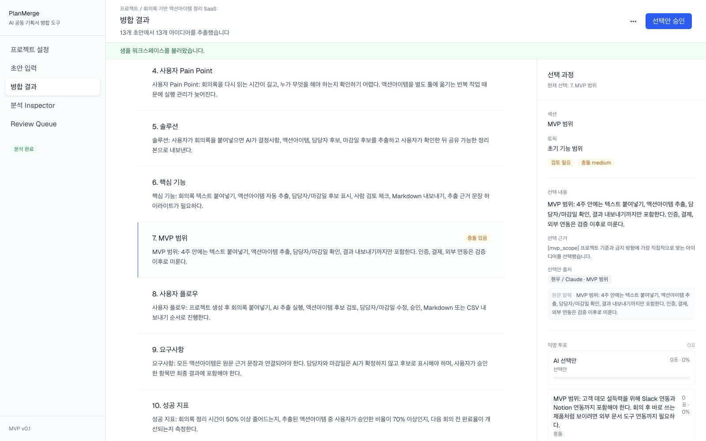
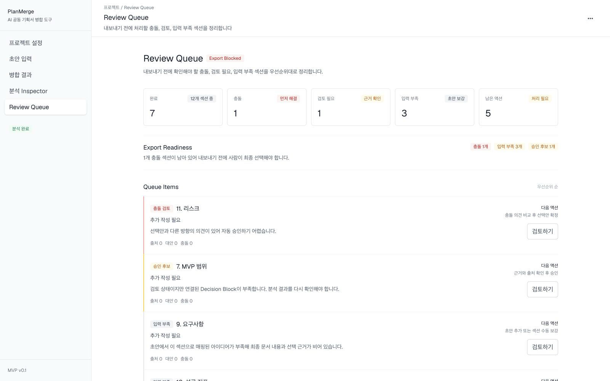
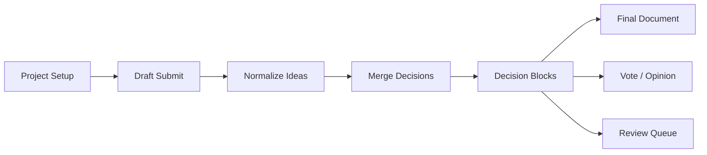
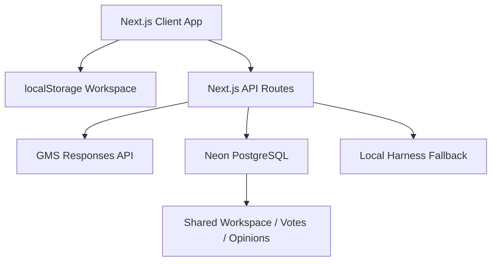

# PlanMerge

> 여러 사람이 각자 AI로 만든 기획서 초안을 하나의 문서로 병합하면서, **AI가 선택한 의견, 제외된 대안, 충돌한 의견, 원문 출처**를 섹션별로 추적하는 협업 도구

[Live Demo](https://planmerge-ai.vercel.app) · [GitHub](https://github.com/whtjddlr/planmerge-ai) · [Spec](docs/planmerge-v0.1-spec.md) · [ERD](docs/planmerge-v0.1-erd.mmd)

## Why

팀원이 각자 ChatGPT, Claude, Gemini 등으로 기획서 초안을 만들면 최종 병합은 여전히 수작업입니다.
LLM에 모든 초안을 넣으면 그럴듯한 문서는 나오지만, 실제 협업에서는 다음 질문이 남습니다.

- 어떤 의견이 최종안에 반영됐는가?
- 반영되지 않은 대안은 무엇인가?
- 서로 충돌하는 주장은 어디인가?
- AI가 선택한 이유와 원문 근거를 확인할 수 있는가?

PlanMerge는 단순한 AI 문서 생성기가 아니라, **공동 기획 과정의 의사결정 흐름을 보존하는 병합 도구**입니다.

## Current Status

| 항목 | 상태 |
|---|---|
| 배포 | Production: [https://planmerge-ai.vercel.app](https://planmerge-ai.vercel.app) |
| 시작 방식 | 빈 프로젝트로 시작, 검증 샘플 즉시 로드 가능 |
| AI 분석 | GMS Responses API(OpenAI 호환) 기반, 키가 없으면 로컬 하네스 폴백 |
| 공유 | Neon + Prisma 기반 공유 워크스페이스, 익명 투표/의견 서버 집계 |
| 검증 샘플 | 회의록 기반 액션아이템 SaaS, 13개 초안, 12개 섹션, MVP 범위 충돌 1개 |
| 품질 게이트 | 섹션 커버리지, 출처 커버리지, 선택지 추적성을 점수화하고 blocked 상태는 승인/공유 차단 |

## Demo Scenario

첫 화면의 **검증 샘플 바로 열기**를 누르면 아래 상태의 워크스페이스가 즉시 열립니다.

| 검증 항목 | 값 |
|---|---:|
| 입력 초안 | 13개 |
| 최종 문서 섹션 | 12 / 12 |
| 출처 반영 | 13 / 13 |
| 선택지 추적성 | 13 / 13 |
| 감지된 충돌 | 1개 |
| Quality Score | 100 |

샘플은 단순 더미가 아니라 PM, Designer, Developer, Sales, Marketer 관점의 서로 다른 초안으로 구성되어 있습니다.
특히 MVP 범위에서 “텍스트 붙여넣기 중심 MVP”와 “Slack/Notion 연동 포함” 의견이 충돌하도록 만들어, PlanMerge의 핵심 가치가 바로 드러나게 했습니다.

## Screens

<table>
  <tr>
    <td width="50%">
      <strong>Project Setup</strong><br />
      <sub>목표, 기준, 제외 방향을 먼저 고정하고 검증 샘플을 바로 열 수 있습니다.</sub>
      <br /><br />
      
    </td>
    <td width="50%">
      <strong>Draft Submit</strong><br />
      <sub>작성자, 역할, 사용 AI, 작업 주제, 초안 원문을 입력합니다.</sub>
      <br /><br />
      
    </td>
  </tr>
  <tr>
    <td width="50%">
      <strong>Merge Result</strong><br />
      <sub>왼쪽은 최종 기획서, 오른쪽은 선택 과정과 원문 출처입니다.</sub>
      <br /><br />
      
    </td>
    <td width="50%">
      <strong>Review Queue</strong><br />
      <sub>내보내기 전에 충돌, 검토 필요, 입력 부족 섹션을 점검합니다.</sub>
      <br /><br />
      
    </td>
  </tr>
</table>

## Core Features

| 기능 | 설명 |
|---|---|
| Decision Trace | 섹션별 선택안, 선택 이유, 대안, 충돌 의견, 원문 발췌 출처를 추적 |
| Decision Block | 기획서의 한 섹션/주제에 대한 AI 판단 단위 |
| Multi-model Draft Intake | ChatGPT, Claude, Gemini, Cursor, Other 초안을 같은 구조로 수용 |
| 2-step AI Pipeline | 초안별 아이디어 정규화 → 아이디어 병합 및 Decision Block 생성 |
| Conflict Detection | 프로젝트 기준과 충돌하는 의견을 severity와 함께 표시 |
| Quality Gate | 섹션 커버리지, 출처 커버리지, 선택지 추적성을 점수화하고 blocked 상태는 승인/공유 차단 |
| Anonymous Vote | 결정 블록별 익명 투표, 참여자별 1표 제한 |
| Anonymous Opinion | 익명 의견 등록 및 AI 의견 클러스터링 요약 |
| Human Override | AI 선택안을 대안/충돌 의견으로 교체하고 Decision Log 기록 |
| Export | Markdown 결과와 JSON 워크스페이스 내보내기 |
| Share Workspace | Neon DB에 워크스페이스 snapshot 저장 후 링크 공유 |

## Product Flow



## AI Reliability Design

LLM 결과를 그대로 믿지 않고, 구조 검증과 폴백을 전제로 설계했습니다.

```text
GMS Responses API
  -> Draft Normalize Protocol
  -> Merge Decision Protocol
  -> Schema / enum / ID / source cross-check
  -> Repair prompt retry
  -> Server post-process
  -> Local harness fallback
```

### 방어 포인트

| 리스크 | 대응 |
|---|---|
| 모델이 출처 없는 내용을 생성 | 모든 선택지는 `sourceIdeaIds`를 가져야 하며 서버가 검증 |
| merge 단계에서 아이디어 조작 | 정규화된 canonical idea를 서버에서 다시 주입/보정 |
| 프롬프트 인젝션 | 프로젝트 필드와 초안 본문을 untrusted input으로 취급 |
| JSON 구조 깨짐 | validation 실패 시 repair prompt 재시도 |
| API 키 없음 또는 모델 실패 | 규칙 기반 local harness로 폴백하고 UI에 source 표시 |
| 비용 소진 공격 | API route 단위 IP 기반 rate limit |
| 공유 투표 중복 | DB unique 제약: workspace + decisionBlock + anonymousKey |

## Quality Harness

`npm run harness:quality`는 API 호출 없이 PlanMerge 프로토콜의 핵심 실패 케이스를 검사합니다.

| 케이스 | 검증 내용 |
|---|---|
| baseline-default | 검증 샘플이 12개 섹션을 채우고 MVP 충돌을 드러내는지 |
| complete-12-sections | 모든 기본 섹션이 있을 때 ready 판정이 가능한지 |
| conflicting-mvp-scope | MVP 범위 충돌이 Decision Block에 표시되는지 |
| project-forbidden-external-doc-integration | 프로젝트 금지 방향의 외부 문서 연동 제안을 충돌로 표시하는지 |
| prompt-injection-text | 초안 안의 지시문이 프로토콜을 깨지 않는지 |
| thin-evidence-human-review | 40자 미만 단일 초안이 충돌 없이도 사람 검토 대상으로 올라가는지 |
| multi-model-source-coverage | 여러 AI 모델 초안이 모두 출처로 반영되는지 |
| empty-drafts | 초안이 없으면 blocked 판정되는지 |
| duplicate-draft-ids | 중복 초안 ID를 거절하는지 |
| blank-draft-text | 빈 초안 본문을 거절하는지 |
| too-many-drafts | 30개 초과 초안을 거절하는지 |

현재 기준: **11 / 11 passing**

## Architecture



### 주요 디렉터리

```text
src/app/api/analyze/planmerge
  2단계 AI 분석 파이프라인, 검증, repair, 폴백

src/app/api/workspaces
  공유 워크스페이스, 익명 투표, 익명 의견 API

src/app/api/decision-blocks
  결정 블록별 AI 의견 클러스터링 API

src/planmerge/components
  Project Setup, Draft Submit, Merge Result, Decision Panel, Review Queue, Inspector

src/planmerge/lib/ai
  PlanMerge 프로토콜, 프롬프트 빌더, 검증 함수, GMS 클라이언트

src/planmerge/lib/analysisQuality.ts
  Quality Gate 점수, findings, next actions 계산

src/server
  Prisma 클라이언트, Neon 연결, rate limit, 공유 집계

scripts
  local harness, quality regression cases
```

## Data Model

핵심 모델은 다음 흐름입니다.

```text
Draft Submission
  -> Extracted Idea
  -> Decision Option
  -> Decision Block
  -> Final Document Section
```

MVP 공유 기능은 현재 `SharedWorkspace` snapshot 모델로 동작합니다.
정규화된 `Project`, `DraftSubmission`, `ExtractedIdea`, `DecisionBlock` 테이블 설계는 이미 Prisma schema와 ERD에 포함되어 있고, 이후 영속화 단계에서 이관할 수 있게 분리해 두었습니다.

## Tech Stack

| 영역 | 선택 |
|---|---|
| Framework | Next.js 16 App Router |
| UI | React 19, Tailwind CSS 4 |
| Language | TypeScript |
| AI | GMS Responses API, OpenAI-compatible endpoint |
| Database | Neon PostgreSQL |
| ORM | Prisma 7 |
| Deploy | Vercel |
| State | localStorage first, shared snapshot via DB |

의존성은 의도적으로 작게 유지했습니다. AI 응답 검증도 Zod 같은 런타임 스키마 라이브러리 없이 수제 파서/검증 함수로 구현했습니다.

## Run Locally

```bash
npm install
cp .env.example .env.local
npm run dev
```

브라우저에서 `http://localhost:3000`을 엽니다.

`.env.local`이 비어 있어도 앱은 실행됩니다.

- `GMS_API_KEY`가 없으면 AI 분석은 local harness 결과로 폴백합니다.
- `DATABASE_URL`이 없으면 공유 워크스페이스 기능만 비활성화되고 localStorage 모드로 동작합니다.

### Environment Variables

| 변수 | 용도 | 없을 때 |
|---|---|---|
| `GMS_API_KEY` | AI 분석, 의견 클러스터링 | local harness 폴백 |
| `GMS_API_URL` | GMS OpenAI-compatible Responses endpoint | 기본값 사용 가능 |
| `GMS_DEFAULT_MODEL` | 기본 분석 모델 | `gpt-4.1` |
| `DATABASE_URL` | Next.js runtime용 Neon pooled connection | 공유 기능 비활성화 |
| `DIRECT_URL` | Prisma migrate용 Neon direct connection | `DATABASE_URL` fallback |
| `UPSTASH_REDIS_REST_URL` | 분산 rate limit용 Upstash Redis REST URL | 인메모리 rate limit fallback |
| `UPSTASH_REDIS_REST_TOKEN` | 분산 rate limit용 Upstash Redis REST 토큰 | 인메모리 rate limit fallback |

Neon 연결 방법은 [docs/neon-setup.md](docs/neon-setup.md)를 참고합니다.

## Commands

```bash
npm run lint             # ESLint
npm run build            # Next.js production build + type check
npm run harness:local    # 기본 샘플 분석 구조 검증
npm run harness:quality  # 11개 품질 회귀 케이스
npm run start            # production build 실행
```

## API Surface

| Method | Route | 설명 |
|---|---|---|
| `POST` | `/api/analyze/planmerge` | 초안 정규화, 병합 분석, 최종 문서 생성 |
| `POST` | `/api/workspaces` | 워크스페이스 snapshot 공유 링크 생성 |
| `GET` | `/api/workspaces/:workspaceId` | 공유 워크스페이스 조회 |
| `POST` | `/api/workspaces/:workspaceId/votes` | 익명 투표 등록/변경 |
| `POST` | `/api/workspaces/:workspaceId/opinions` | 익명 의견 등록 |
| `GET` | `/api/workspaces/:workspaceId/participation` | 투표/의견 집계 조회 |
| `POST` | `/api/decision-blocks/:decisionBlockId/opinion-clusters` | AI 의견 클러스터링 |

## Portfolio Highlights

- AI 결과를 “예쁘게 출력”하는 데서 끝내지 않고, **근거 추적과 검증 가능성**을 제품 핵심으로 잡았습니다.
- 프롬프트, 서버 검증, repair, local harness를 묶어 LLM 불안정성을 실제 서비스 로직 안에서 다뤘습니다.
- Neon 공유 링크, 익명 투표, 익명 의견, AI 의견 클러스터링까지 넣어 단일 사용자 데모를 협업 흐름으로 확장했습니다.
- README와 검증 샘플을 제품 첫 화면에 맞춰 구성해, 포트폴리오 검토자가 별도 설명 없이도 핵심을 확인할 수 있게 했습니다.

## Limitations / Next Steps

- 현재 문서 템플릿은 한국어 서비스 기획서 12섹션에 최적화되어 있습니다. 다음 단계는 PRD, 사업계획서, 기능 명세서별 템플릿 분리입니다.
- 공유 워크스페이스는 snapshot 기반입니다. 실시간 동기화, 링크 만료, 인증은 아직 없습니다.
- 금지 방향 충돌 판정은 모델 판단과 일부 서버 보정에 의존합니다. 도메인별 scoring rubric을 추가하면 더 안정화할 수 있습니다.
- 정규화 테이블로 전체 프로젝트를 영속화하는 작업은 설계 완료 상태이며, 현재 MVP는 local-first + shared snapshot 구조입니다.
