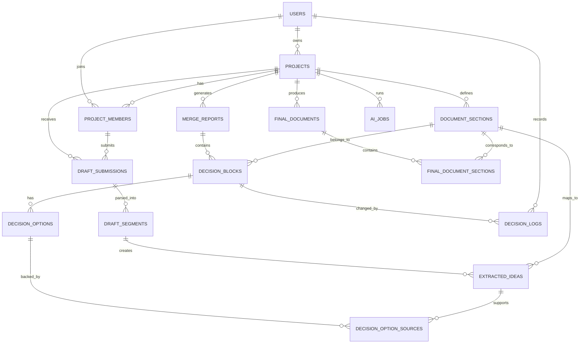

# PlanMerge v0.1 명세서

상태: Draft  
버전: v0.1  
목표: 붙여넣기 기반 단일 페이지 MVP의 제품 범위, 핵심 데이터 모델, ERD, API, AI 처리 흐름을 고정한다.

## 1. 서비스 정의

서비스명: PlanMerge

한 줄 설명:

```text
여러 AI 기획서 초안을 하나의 기획서로 병합하면서,
AI가 선택한 아이디어와 선택되지 않은 다른 의견을 섹션별로 추적할 수 있는 도구.
```

핵심 가치:

```text
최종 기획서만 보여주는 것이 아니라,
왜 이 내용이 선택됐는지와 어떤 다른 의견이 있었는지를 함께 보여준다.
```

## 2. MVP 범위

포함할 기능:

1. 프로젝트 생성
2. 기획서 목표 / 공통 기준 입력
3. 여러 AI 초안 붙여넣기
4. AI가 초안에서 아이디어 추출
5. 섹션별로 아이디어 분류
6. AI가 선택안 / 대안 / 충돌 의견 생성
7. 최종 기획서 초안 생성
8. 사용자가 섹션별 선택 근거 확인

초기 제외 기능:

```text
팀 초대
실시간 공동 편집
댓글 기능
권한 관리
Google Docs 연동
Notion 연동
Slack 연동
결제
복잡한 버전 관리
```

초기 제품 형태:

```text
붙여넣기 기반 단일 페이지 웹앱
```

## 3. 추천 기술 스택

MVP 기준:

```text
Frontend:
- Next.js
- React
- Tailwind CSS
- shadcn/ui

Backend:
- Next.js API Route 또는 Server Actions

Database:
- Supabase PostgreSQL

ORM:
- Prisma 또는 Drizzle

AI:
- OpenAI API
- 추후 Anthropic / Gemini 확장 가능

Deploy:
- Vercel

Auth:
- 초기에는 Supabase Auth
- 더 가볍게 시작하면 로그인 없이도 가능
```

선정 이유:

```text
Next.js:
- 프론트와 백엔드를 한 프로젝트에서 처리 가능

Supabase:
- PostgreSQL, Auth, Storage를 빠르게 붙일 수 있음

Prisma:
- ERD 기반으로 DB 모델 관리하기 쉬움

OpenAI API:
- 초안 분석, 아이디어 추출, 병합 리포트 생성에 사용
```

## 4. 핵심 개념

PlanMerge의 중심 데이터는 Decision Block이다.

Decision Block은 기획서의 각 섹션마다 AI가 선택한 내용, 선택 이유, 다른 의견, 충돌 의견을 묶는 단위다.

예시:

```text
섹션: MVP 범위

AI 선택안:
- 텍스트 붙여넣기 + 병합 리포트 생성까지만 포함한다.

다른 의견:
- Slack 연동까지 포함하자.
- 실시간 공동 편집도 넣자.
- Notion 연동을 먼저 하자.

AI 선택 이유:
- 초기 검증 목표는 병합 기능의 유용성 확인이므로 범위를 줄이는 것이 적절하다.

충돌 여부:
- 기능 범위에 대한 충돌 있음.
```

프론트 기준 타입:

```ts
type DecisionBlock = {
  section: string;
  topic: string;
  selectedIdea: string;
  selectionReason: string;
  alternativeIdeas: string[];
  conflicts: string[];
  needsHumanReview: boolean;
};
```

## 5. 사용자 흐름

```text
1. 사용자가 프로젝트 생성
   ↓
2. 프로젝트 목표와 공통 기준 입력
   ↓
3. 팀원들이 만든 AI 초안 여러 개 붙여넣기
   ↓
4. AI가 각 초안에서 아이디어 추출
   ↓
5. 아이디어를 기획서 섹션별로 분류
   ↓
6. 유사한 아이디어는 묶고, 충돌하는 아이디어는 표시
   ↓
7. 섹션별 Decision Block 생성
   ↓
8. 최종 기획서 초안 생성
   ↓
9. 사용자는 각 섹션에서 선택안 / 다른 의견 / 충돌을 확인
```

## 6. 화면 구성

### 6.1 Project Setup

입력 항목:

```text
프로젝트명
기획서 목표
기획서 타입
공통 기준
금지할 방향
원하는 출력 스타일
```

예시:

```text
프로젝트명:
AI 공동 기획서 병합 도구

목표:
여러 사람이 각자 AI로 만든 기획서 초안을 하나의 문서로 병합한다.

공통 기준:
MVP는 2주 안에 만들 수 있어야 한다.
초기에는 텍스트 붙여넣기 기반으로 한다.
```

### 6.2 Draft Submit

입력 항목:

```text
초안 작성자
작성자 역할
사용한 AI
작업 주제
AI 초안 원문
```

예시:

```text
작성자: 민수
역할: PM
사용 AI: ChatGPT
작업 주제: 문제 정의
초안 원문: ...
```

### 6.3 Merge Result

좌측은 최종 기획서, 우측은 선택 과정이다.

```text
┌──────────────────────────────┬──────────────────────────────┐
│ 최종 기획서                   │ 선택 과정                     │
│                              │                              │
│ 1. 개요                       │ AI 선택안                     │
│ 2. 문제 정의                  │ 선택 이유                     │
│ 3. 타깃 사용자                │ 다른 의견                     │
│ 4. 핵심 기능                  │ 충돌 의견                     │
│ 5. MVP 범위                   │ 출처 초안                     │
└──────────────────────────────┴──────────────────────────────┘
```

## 7. 기획서 기본 섹션

MVP에서는 기획서 구조를 고정한다. DB에는 `document_sections`로 저장한다.

```text
1. 개요
2. 문제 정의
3. 타깃 사용자
4. 사용자 Pain Point
5. 솔루션
6. 핵심 기능
7. MVP 범위
8. 사용자 플로우
9. 요구사항
10. 성공 지표
11. 리스크
12. 미결정 사항
```

## 8. ERD



## 9. 테이블 명세

### 9.1 users

사용자 정보.

```ts
type User = {
  id: string;
  email: string;
  name: string;
  createdAt: Date;
};
```

초기 MVP에서는 로그인 없이도 가능하지만, 나중에 팀 기능을 넣으려면 필요하다.

### 9.2 projects

기획서 프로젝트.

```ts
type Project = {
  id: string;
  ownerId: string;
  title: string;
  goal: string;
  documentType: "service_plan" | "prd" | "business_plan" | "feature_spec";
  contextPack: string;
  status: "draft" | "analyzing" | "completed";
  createdAt: Date;
  updatedAt: Date;
};
```

예시:

```json
{
  "title": "AI 공동 기획서 병합 도구",
  "goal": "여러 AI 초안을 하나의 기획서로 병합한다.",
  "documentType": "service_plan",
  "contextPack": "MVP는 2주 안에 만들 수 있어야 한다."
}
```

### 9.3 project_members

프로젝트 참여자.

```ts
type ProjectMember = {
  id: string;
  projectId: string;
  userId?: string;
  displayName: string;
  role: "pm" | "designer" | "developer" | "marketer" | "other";
  createdAt: Date;
};
```

초기에는 `userId` 없이 `displayName`만 써도 된다.

### 9.4 document_sections

기획서 섹션.

```ts
type DocumentSection = {
  id: string;
  projectId: string;
  sectionKey: string;
  title: string;
  description?: string;
  sortOrder: number;
  createdAt: Date;
};
```

예시:

```json
{
  "sectionKey": "mvp_scope",
  "title": "MVP 범위",
  "sortOrder": 7
}
```

### 9.5 draft_submissions

팀원이 제출한 AI 초안 원문.

```ts
type DraftSubmission = {
  id: string;
  projectId: string;
  memberId?: string;
  authorName: string;
  authorRole?: string;
  aiModel: "ChatGPT" | "Claude" | "Gemini" | "Cursor" | "Other";
  taskTitle: string;
  rawText: string;
  status: "submitted" | "parsed" | "failed";
  createdAt: Date;
};
```

예시:

```json
{
  "authorName": "민수",
  "authorRole": "pm",
  "aiModel": "ChatGPT",
  "taskTitle": "문제 정의 작성",
  "rawText": "여러 사람이 AI로 기획서를 작성하면..."
}
```

### 9.6 draft_segments

초안 원문을 의미 단위로 쪼갠 결과.

```ts
type DraftSegment = {
  id: string;
  draftSubmissionId: string;
  sectionId?: string;
  segmentType: "claim" | "assumption" | "evidence" | "requirement" | "risk" | "opinion";
  content: string;
  createdAt: Date;
};
```

예시:

```json
{
  "segmentType": "claim",
  "content": "초기 MVP는 텍스트 붙여넣기 기반이어야 한다."
}
```

### 9.7 extracted_ideas

AI가 추출한 정규화된 아이디어.

```ts
type ExtractedIdea = {
  id: string;
  projectId: string;
  sectionId: string;
  draftSegmentId?: string;
  topic: string;
  ideaType: "problem" | "target_user" | "feature" | "scope" | "metric" | "risk" | "requirement";
  normalizedText: string;
  confidence: number;
  createdAt: Date;
};
```

예시:

```json
{
  "topic": "MVP 범위",
  "ideaType": "scope",
  "normalizedText": "초기 MVP는 텍스트 붙여넣기와 병합 리포트 생성에 집중한다.",
  "confidence": 0.84
}
```

### 9.8 merge_reports

전체 병합 분석 결과.

```ts
type MergeReport = {
  id: string;
  projectId: string;
  summary: string;
  missingSections: string[];
  overallRiskLevel: "low" | "medium" | "high";
  createdAt: Date;
};
```

예시:

```json
{
  "summary": "전체 초안은 AI 기획서 병합 도구라는 방향에서는 일치하지만, MVP 범위와 초기 타깃에서 충돌이 있다.",
  "missingSections": ["성공 지표", "가격 정책"],
  "overallRiskLevel": "medium"
}
```

### 9.9 decision_blocks

이 서비스의 핵심 테이블. 각 섹션/주제별로 AI가 어떤 아이디어를 선택했는지 관리한다.

```ts
type DecisionBlock = {
  id: string;
  mergeReportId: string;
  projectId: string;
  sectionId: string;
  topic: string;
  selectedSummary: string;
  selectionReason: string;
  confidence: number;
  conflictLevel: "none" | "low" | "medium" | "high";
  status: "auto_selected" | "needs_review" | "approved" | "overridden";
  createdAt: Date;
};
```

예시:

```json
{
  "topic": "MVP 범위",
  "selectedSummary": "초기 MVP는 텍스트 붙여넣기와 병합 리포트 생성까지만 포함한다.",
  "selectionReason": "여러 초안에서 공통적으로 빠른 검증과 작은 범위를 강조했기 때문이다.",
  "conflictLevel": "high",
  "status": "needs_review"
}
```

### 9.10 decision_options

각 Decision Block 안에 들어가는 선택지.

```ts
type DecisionOption = {
  id: string;
  decisionBlockId: string;
  optionType: "selected" | "alternative" | "conflict" | "rejected";
  content: string;
  differenceFromSelected?: string;
  rationale?: string;
  severity?: "low" | "medium" | "high";
  createdAt: Date;
};
```

예시:

```json
[
  {
    "optionType": "selected",
    "content": "텍스트 붙여넣기와 병합 리포트 생성까지만 포함한다."
  },
  {
    "optionType": "alternative",
    "content": "Notion 연동까지 포함한다.",
    "differenceFromSelected": "외부 문서 도구 연동을 초기 범위에 포함한다."
  },
  {
    "optionType": "conflict",
    "content": "실시간 공동 편집 기능까지 포함한다.",
    "differenceFromSelected": "MVP 범위를 크게 확장한다.",
    "severity": "high"
  }
]
```

### 9.11 decision_option_sources

선택지의 출처. 어떤 초안, 어떤 아이디어에서 나왔는지 추적한다.

```ts
type DecisionOptionSource = {
  id: string;
  decisionOptionId: string;
  extractedIdeaId: string;
  sourceExcerpt: string;
  createdAt: Date;
};
```

예시:

```json
{
  "sourceExcerpt": "MVP에서는 Slack과 Notion 연동까지 제공해야 한다."
}
```

이 테이블이 있어야 사용자가 "이 다른 의견은 어디서 나온 거야?"를 확인할 수 있다.

### 9.12 final_documents

최종 통합 기획서.

```ts
type FinalDocument = {
  id: string;
  projectId: string;
  mergeReportId: string;
  version: number;
  title: string;
  contentMarkdown: string;
  createdAt: Date;
};
```

### 9.13 final_document_sections

최종 기획서의 섹션별 내용.

```ts
type FinalDocumentSection = {
  id: string;
  finalDocumentId: string;
  sectionId: string;
  title: string;
  content: string;
  sortOrder: number;
};
```

이 테이블을 따로 두면 사용자가 특정 섹션을 클릭했을 때 오른쪽에 Decision Block을 보여주기 쉽다.

### 9.14 decision_logs

사용자가 AI 선택안을 승인하거나 바꾼 기록.

```ts
type DecisionLog = {
  id: string;
  projectId: string;
  decisionBlockId: string;
  actorId?: string;
  action: "approved" | "overridden" | "commented";
  beforeValue?: string;
  afterValue?: string;
  reason?: string;
  createdAt: Date;
};
```

예시:

```json
{
  "action": "overridden",
  "beforeValue": "초기 타깃은 스타트업 팀",
  "afterValue": "초기 타깃은 대학생 팀 프로젝트",
  "reason": "초기 테스트 사용자를 확보하기 쉽기 때문"
}
```

### 9.15 ai_jobs

AI 처리 작업 상태.

```ts
type AIJob = {
  id: string;
  projectId: string;
  jobType: "parse_drafts" | "extract_ideas" | "merge_analysis" | "generate_final_document";
  status: "pending" | "running" | "completed" | "failed";
  inputSnapshot?: object;
  outputSnapshot?: object;
  errorMessage?: string;
  createdAt: Date;
  completedAt?: Date;
};
```

AI 호출 결과를 추적하려면 필요하다.

## 10. 핵심 데이터 관계

가장 중요한 관계:

```text
DraftSubmission
  → DraftSegment
  → ExtractedIdea
  → DecisionOption
  → DecisionBlock
  → FinalDocumentSection
```

즉:

```text
초안 원문
→ 의미 단위 추출
→ 아이디어 정규화
→ 선택지 생성
→ AI 선택안 결정
→ 최종 기획서 반영
```

## 11. Prisma 스타일 스키마 예시

```prisma
model Project {
  id           String   @id @default(uuid())
  ownerId      String?
  title        String
  goal         String
  documentType String
  contextPack  String?
  status       String   @default("draft")
  createdAt    DateTime @default(now())
  updatedAt    DateTime @updatedAt

  sections     DocumentSection[]
  drafts       DraftSubmission[]
  mergeReports MergeReport[]
  finalDocs    FinalDocument[]
}
```

```prisma
model DraftSubmission {
  id         String   @id @default(uuid())
  projectId  String
  memberId   String?
  authorName String
  authorRole String?
  aiModel    String?
  taskTitle  String?
  rawText    String
  status     String   @default("submitted")
  createdAt  DateTime @default(now())

  project    Project  @relation(fields: [projectId], references: [id])
  segments   DraftSegment[]
}
```

```prisma
model DecisionBlock {
  id              String   @id @default(uuid())
  projectId       String
  mergeReportId   String
  sectionId       String
  topic           String
  selectedSummary String
  selectionReason String?
  confidence      Float?
  conflictLevel   String   @default("none")
  status          String   @default("auto_selected")
  createdAt       DateTime @default(now())

  options         DecisionOption[]
}
```

```prisma
model DecisionOption {
  id                     String   @id @default(uuid())
  decisionBlockId        String
  optionType             String
  content                String
  differenceFromSelected String?
  rationale              String?
  severity               String?
  createdAt              DateTime @default(now())

  decisionBlock          DecisionBlock @relation(fields: [decisionBlockId], references: [id])
  sources                DecisionOptionSource[]
}
```

## 12. API 명세 초안

### 12.1 프로젝트 생성

```http
POST /api/projects
```

요청:

```json
{
  "title": "AI 공동 기획서 병합 도구",
  "goal": "여러 AI 초안을 하나의 기획서로 병합한다.",
  "documentType": "service_plan",
  "contextPack": "MVP는 2주 안에 만들 수 있어야 한다."
}
```

### 12.2 초안 제출

```http
POST /api/projects/:projectId/drafts
```

요청:

```json
{
  "authorName": "민수",
  "authorRole": "pm",
  "aiModel": "ChatGPT",
  "taskTitle": "문제 정의",
  "rawText": "여러 사람이 AI로 기획서를 작성하면..."
}
```

### 12.3 병합 분석 실행

```http
POST /api/projects/:projectId/analyze
```

처리 순서:

```text
1. draft_submissions 조회
2. draft_segments 생성
3. extracted_ideas 생성
4. decision_blocks 생성
5. decision_options 생성
6. final_document 생성
```

### 12.4 병합 결과 조회

```http
GET /api/projects/:projectId/merge-report
```

응답 예시:

```json
{
  "summary": "MVP 범위와 초기 타깃 사용자에서 충돌이 있습니다.",
  "decisionBlocks": [
    {
      "section": "MVP 범위",
      "topic": "초기 기능 범위",
      "selectedSummary": "텍스트 붙여넣기와 병합 리포트 생성까지만 포함한다.",
      "selectionReason": "빠른 검증을 위해 기능 범위를 줄이는 것이 적절합니다.",
      "conflictLevel": "high",
      "options": [
        {
          "type": "selected",
          "content": "텍스트 붙여넣기와 병합 리포트 생성"
        },
        {
          "type": "alternative",
          "content": "Notion 연동 포함"
        },
        {
          "type": "conflict",
          "content": "실시간 공동 편집 포함"
        }
      ]
    }
  ]
}
```

### 12.5 선택안 승인 / 변경

```http
PATCH /api/decision-blocks/:decisionBlockId
```

요청:

```json
{
  "status": "approved",
  "selectedOptionId": "option_123",
  "reason": "MVP 범위를 줄이는 것이 적절함"
}
```

## 13. AI 처리 파이프라인

### 13.1 Step 1. Draft Parse

입력된 초안을 의미 단위로 분해한다.

출력:

```json
{
  "segments": [
    {
      "type": "claim",
      "content": "초기 MVP는 텍스트 붙여넣기 기반이어야 한다."
    },
    {
      "type": "risk",
      "content": "Notion 연동은 초기 개발 범위를 키울 수 있다."
    }
  ]
}
```

### 13.2 Step 2. Idea Extraction

각 segment를 기획서 아이디어로 정규화한다.

출력:

```json
{
  "ideas": [
    {
      "section": "MVP 범위",
      "topic": "초기 기능 범위",
      "normalizedText": "초기 MVP는 텍스트 붙여넣기와 병합 리포트 생성에 집중한다.",
      "ideaType": "scope",
      "confidence": 0.86
    }
  ]
}
```

### 13.3 Step 3. Merge Analysis

비슷한 아이디어, 다른 의견, 충돌 의견을 묶는다.

출력:

```json
{
  "decisionBlocks": [
    {
      "section": "MVP 범위",
      "topic": "초기 기능 범위",
      "selectedSummary": "텍스트 붙여넣기와 병합 리포트 생성까지만 포함한다.",
      "selectionReason": "초기 검증에 필요한 최소 기능이기 때문이다.",
      "options": [
        {
          "type": "selected",
          "content": "텍스트 붙여넣기와 병합 리포트 생성"
        },
        {
          "type": "alternative",
          "content": "Notion 연동 포함"
        },
        {
          "type": "conflict",
          "content": "실시간 공동 편집 포함"
        }
      ],
      "conflictLevel": "high"
    }
  ]
}
```

### 13.4 Step 4. Final Document Generation

Decision Block을 기반으로 최종 기획서를 생성한다.

출력:

```markdown
# AI 공동 기획서 병합 도구 기획서

## 1. 개요

PlanMerge는 여러 사람이 각자 AI로 작성한 기획서 초안을 하나의 문서로 병합하는 도구다.

## 2. 문제 정의

여러 사람이 AI로 초안을 작성하면 중복, 충돌, 누락이 발생한다.
```

## 14. MVP 핵심 화면 데이터 구조

프론트에서는 이 구조가 핵심이다.

```ts
type MergeViewModel = {
  finalDocument: {
    sections: {
      sectionId: string;
      title: string;
      content: string;
    }[];
  };

  decisionTrace: {
    sectionId: string;
    topic: string;
    selected: {
      content: string;
      reason: string;
      confidence: number;
    };
    alternatives: {
      content: string;
      difference: string;
      sources: string[];
    }[];
    conflicts: {
      content: string;
      severity: "low" | "medium" | "high";
      sources: string[];
    }[];
    needsReview: boolean;
  }[];
};
```

이 구조로 아래 화면을 구현한다.

```text
왼쪽: 최종 기획서
오른쪽: 해당 섹션의 선택안 / 다른 의견 / 충돌
```

## 15. 개발 우선순위

1차:

```text
프로젝트 생성
초안 여러 개 입력
AI 병합 분석
최종 기획서 출력
Decision Block 출력
```

2차:

```text
선택안 승인 / 변경
출처 보기
섹션 클릭 시 우측 패널 표시
```

3차:

```text
로그인
프로젝트 저장
팀원별 초안 관리
버전 관리
```

4차:

```text
Notion / Google Docs 연동
댓글
공동 편집
조직 관리
```

## 16. MVP 핵심 성공 기준

처음 검증할 질문:

```text
사용자가 여러 AI 초안을 넣었을 때,
최종 기획서뿐 아니라 어떤 의견들이 있었고 왜 이 내용이 선택됐는지를 쉽게 이해할 수 있는가?
```

측정 기준:

```text
1. 병합 시간 감소
2. 충돌 의견 발견 수
3. 사용자가 선택 근거를 이해하는 데 걸리는 시간
4. 최종 기획서 수정 횟수
5. 다시 사용할 의향
```

## 17. 제일 먼저 만들 DB 최소 버전

진짜 MVP는 아래 6개 테이블만 있어도 된다.

```text
projects
document_sections
draft_submissions
extracted_ideas
decision_blocks
decision_options
```

나중에 추가:

```text
users
project_members
draft_segments
decision_option_sources
decision_logs
final_documents
ai_jobs
```

## 18. v0.1 결정 사항

1. 핵심 모델은 `DecisionBlock`이다.
2. 초기 UX는 최종 기획서와 선택 과정을 나란히 보여준다.
3. 초기 입력은 문서 업로드가 아니라 텍스트 붙여넣기다.
4. 초기 기획서 섹션은 고정한다.
5. 출처 추적은 중요하지만, 최소 DB에서는 `decision_option_sources`를 2차로 미룰 수 있다.
6. 최종 문서 저장은 중요하지만, 첫 데모에서는 분석 응답 안의 view model만으로도 시작할 수 있다.

## 19. 정리

핵심 모델:

```text
Draft Submission
→ Extracted Idea
→ Decision Option
→ Decision Block
→ Final Document
```

핵심 UX:

```text
최종 기획서의 각 섹션을 클릭하면,
AI가 선택한 아이디어,
선택 이유,
다른 의견,
충돌 의견,
출처 초안을 볼 수 있다.
```

이 구조로 가면 PlanMerge는 단순한 AI 기획서 작성기가 아니라, 공동 기획 과정에서 아이디어 선택 흐름을 보여주는 병합 도구가 된다.
